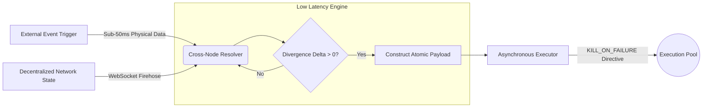

<div align="center">
  <h1>Event-Driven Resolver</h1>
  <p><b>Ultra-Low Latency Cross-Node Execution Engine</b></p>
  
  [](https://github.com/mahimalam/weather-alert-resolver/actions/workflows/ci.yml)
  [](https://python.org)
  [](#)
  [](#)
  [](https://opensource.org/licenses/MIT)

  <p><i>A high-frequency execution protocol designed to intercept, calculate, and resolve physical-world event transitions before network propagation.</i></p>
</div>

<br/>

## ⚡ Executive Summary

In distributed consensus networks, physical reality often diverges from the network's consensus state for a brief window of time (latency divergence). The **Event-Driven Resolver (E2)** is a heavily optimized, ultra-low latency execution engine designed specifically to operate within these sub-second windows. 

While broader orchestration engines rely on complex multi-node graph loops, the Event-Driven Resolver sacrifices mathematical complexity for absolute speed. It utilizes non-blocking WebSocket streams and pre-compiled atomic payloads to synchronize decentralized node states the exact millisecond a physical event occurs.

---

## 🏗️ System Architecture

The architecture is built entirely around latency minimization. Every abstraction layer that could introduce nanoseconds of delay has been stripped out.



---

## 🧩 Core Modules

### 1. Event Detection (`/core_logic`)
This module bypasses standard network state layers to source data directly from the physical phenomena origin.
- **`external_event_trigger.py`**: Intercepts real-world phenomena (e.g., severe weather alerts, structural announcements) via raw, un-parsed API data feeds and direct socket connections. It calculates the theoretical probability shift *before* the broader network reacts.
- **`detector.py`**: Continuously cross-references multiple independent data providers to find micro-latency gaps where one node has updated its state but a secondary node has not.
- **`scanner.py`**: An aggressive polling mechanism that locks onto specific high-volatility nodes when a physical event trigger is detected.

### 2. Payload Construction (`/models`)
- **`types.py`**: Houses the strict, zero-overhead Data Transfer Objects (DTOs) used to pass state between the detector and the executor. Uses `__slots__` and native Python structs to prevent dictionary allocation overhead.

### 3. Atomic Execution (`/execution`)
- **`async_executor.py`**: Contains the protocol for deploying an atomic execution. If the vector cannot be resolved in a single atomic transaction within the `MAX_ROUND_TRIP_MS` (typically <150ms), the payload automatically aborts via a `KILL_ON_FAILURE` directive to preserve operational safety.

---

## ⚙️ Technical Specifications

- **Language:** Python 3.10+
- **Network Stack:** Custom `aiohttp` TCP connection pooling to prevent TLS handshake overhead on payload dispatch.
- **Latency Profile:** Designed to achieve sub-50ms round-trip times from detection to execution completion.
- **Concurrency:** Heavily relies on `asyncio.gather` for simultaneous state polling across disparate geographic servers.

---

## 🚀 Deployment Requirements

The Resolver must be deployed on specialized infrastructure with physical proximity to the primary data hubs.

```bash
# Clone the repository
git clone https://github.com/mahimalam/event-driven-resolver.git

# Install low-latency dependencies
pip install -r requirements.txt

# Start the resolver with a strict latency profile
python main.py --profile low_latency --max-rtt 150
```

